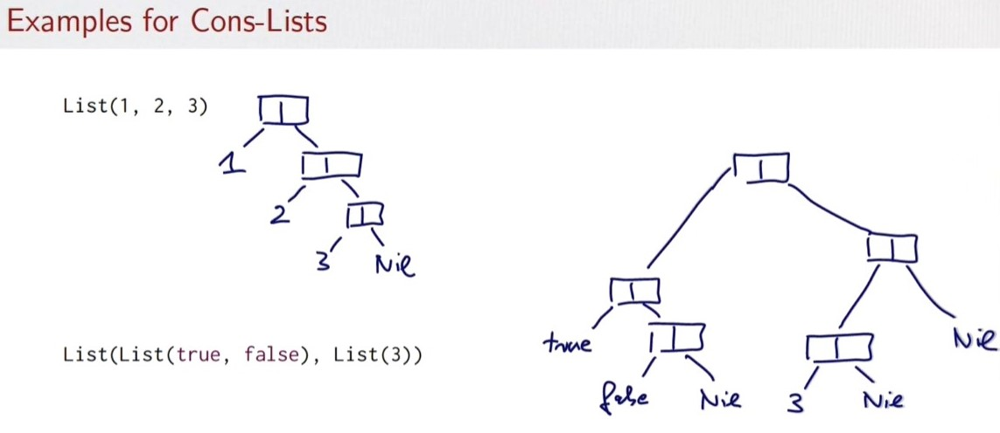

# Cons-Lists
- immutable linked list

- two building blocks
    - Nil : the empty list
    - Cons(::) : a cell containing an element and the remainder of the list

- diagram


- infix operator ::
    - it expresses list extension at the front
    - x::xs represents a list whose first element is x, followed by list xs

- Class ::
    - represents non-empty lists
    - it's named to be able to suport pattern matching with the infix ::
    - x::xs is treated as ::(x, xs) where :: is a case class
    - definition of :: class
    ```
    final case class ::[T](hd: T, tl: List[T]) extends List[T] {
        def head = hd
        def tail = tl
        override def isEmpty: Boolean = false
    }
    ```
    - It takes two parameters hd and tl, representing the head and the tail of the list to be constructed.

- example
```
var empty: List[Nothing] = List()
var empty = Nil

var diag3: List[List[Int]] = List( List(1,0,0), List(0,1,0), List(0,0,1) )
var diag3 = (1:: (0 :: (0 :: Nil))) :: (0:: (1 :: (0 :: Nil))) :: (0:: (0 :: (1 :: Nil)))

var fruits: List[String] = List("apples","oranges","pears")
var fruits = "apples" :: ("oranges" :: ("pears" :: Nil))
var fruits = "apples" :: "oranges" :: "pears" :: Nil // same with previous // :: operation associates to the right
```

- list patterns(destruct)
    - Items in a list can be assigned into another list by pattern matching
    - Example
    ```
    var fruits: List[String] = List("apples","oranges","pears")
    
    var List(a, b, c) = fruits
    // a:String = applies, b:String = oranges, c:String = pears

    var a :: b :: rest = fruits
    // a:String = applies, b:String = oranges, rest: List[String] = List(pears)
    ```

- insert sort using pattern matching
    ```
    def isort(xs: List[Int]): List[Int] = xs match {
        case List() => List()
        case x :: xs1 => insert(x, isort(xs1))
    }

    def insert(x: Int, xs: List[Int]): List[Int] = xs match {
        case List() => List(x)
        case y :: ys => if (x <= y) x :: xs
                        else y :: insert(x, ys)
    }

    ```

- basic operations in list
    - head: returns the first element of the list
    - tail: returns the list consisting of all elements except the first
    - isEmpty: returns true if the list is empty

- concatenating operator :::
    - List(1,2) ::: List(3,4,5)
    - -> List(1,2,3,4,5)

- init , last
    - List(1,2,3,4,5).init --> 1,2,3,4
    - List(1,2,3,4,5).last --> 5

- reverse
    - List(1,2,3,4,5).reverse --> 5,4,3,2,1

- there're more methods